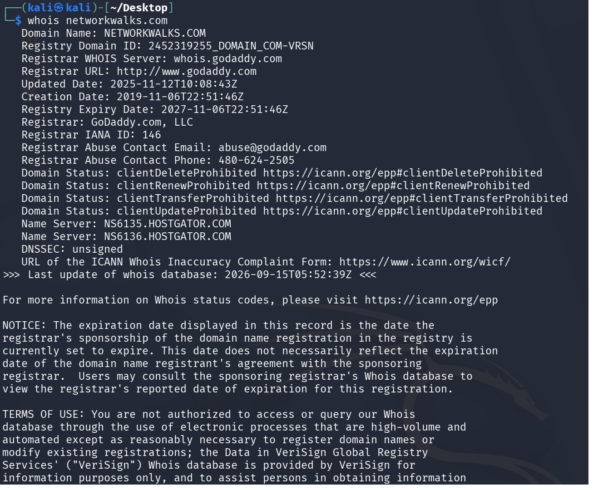
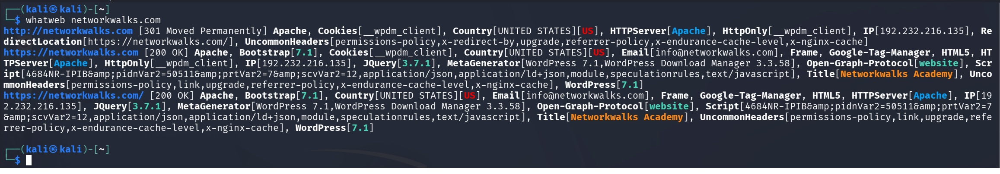
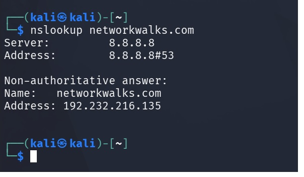
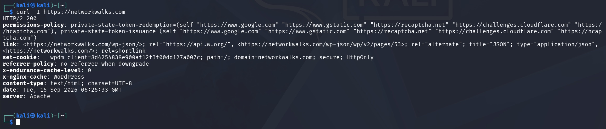
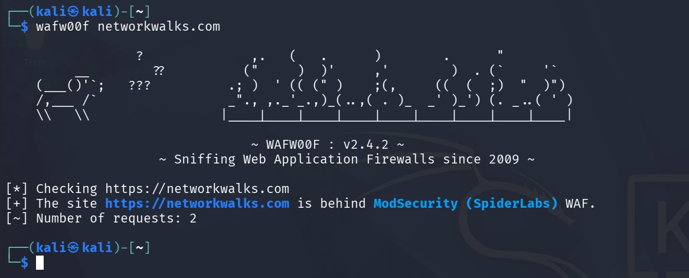
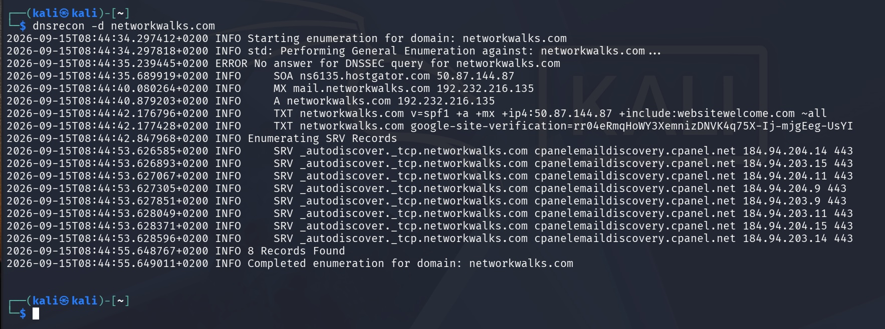

# NETWORKWALKS-EMMANUEL-B083-WK2-PM1-CYBERSECURITY-LAB-SETUP
Week 2 Project
# 🧪 CyberLab — Week 2 Project

## 📌 Project Overview

This project represents **Week 2 of the Cybersecurity Internship Program** at Networkwalks.

The main focus of this week was **Footprinting, Reconnaissance, OSINT, DNS Enumeration, Web Technology Fingerprinting, Network Scanning, and Security Analysis**.

The exercises were performed in a controlled cybersecurity laboratory environment using Kali Linux and Windows.

The objective was to gain practical experience with commonly used reconnaissance and network scanning tools while understanding how publicly available information can be collected and analyzed.

---

# 🎯 Objectives

The main objectives of Week 2 were:

- Perform domain registration reconnaissance.
- Identify web technologies used by a target website.
- Resolve domain names to IP addresses.
- Analyze HTTP response headers.
- Identify Web Application Firewall technologies.
- Enumerate DNS records.
- Practice Google Hacking Database (GHDB) search techniques.
- Perform footprinting using Maltego.
- Perform reconnaissance using theHarvester.
- Perform network discovery using Zenmap.
- Identify live hosts on a local network.
- Document findings in a structured cybersecurity report.

---

# 🧰 Lab Environment

| 🧩 Component | ⚙️ Configuration |
|---|---|
| 🐉 Security OS | Kali Linux 2026.2 |
| 🪟 Host OS | Windows |
| 🧰 Hypervisor | Oracle VirtualBox |
| 🌐 Virtual Network | NAT Network |
| 📡 Network | `10.0.0.0/24` |
| 🛡️ Main Security Tool | Kali Linux |
| 🔎 Reconnaissance | WHOIS, WhatWeb, Nslookup, Curl, Wafw00f, DNSRecon |
| 🕵️ OSINT | Maltego, theHarvester |
| 🗺️ Network Scanning | Zenmap |

---

# 🏗️ Lab Architecture

The CyberLab was created using virtual machines connected through a dedicated VirtualBox NAT Network.

The network uses the private IPv4 range:

`10.0.0.0/24`

The environment allows the virtual machines to communicate with each other while maintaining Internet connectivity.

📸 **SCREENSHOT — Lab Network Topology**

Add the CyberLab network topology screenshot here.

Suggested filename:

`week2-lab-topology.png`

---

# 🛠️ Lab Setup Procedure

## Module 1 — Domain & Web Footprinting

The first module focused on gathering publicly available information about the domain:

`networkwalks.com`

The following tools were used:

1. WHOIS
   ### 📸 Evidence


3. WhatWeb
### 📸 Evidence


4. Nslookup
### 📸 Evidence


5. Curl
### 📸 Evidence


6. Wafw00f
### 📸 Evidence


7. DNSRecon
### 📸 Evidence


---

## 🔎 Task 1 — WHOIS

### Objective

Obtain domain registration information using WHOIS.

### Command

```bash
whois networkwalks.com

# 🧪 CyberLab — Week 2 | Project Module 1

## 🎯 Objective

Perform domain and web reconnaissance against `networkwalks.com` using WHOIS, web technology fingerprinting, DNS analysis, HTTP header inspection, WAF detection, and DNS enumeration.

---

## 🔎 Reconnaissance Tasks

### 1. WHOIS

```bash
whois networkwalks.com

Collected publicly available domain registration information, including the registrar, registration dates, expiration date, WHOIS server, and DNSSEC status.

### 2. WhatWeb
```bash
whatweb networkwalks.com

Identified web technologies including Apache, WordPress, Bootstrap, jQuery, Google Tag Manager, and WordPress Download Manager

### 3. Nslookup
```bash
nslookup networkwalks.com

Resolved networkwalks.com to 192.232.216.135 using DNS server 8.8.8.8.

### 4. Curl
```bash
curl -I https://networkwalks.com

Inspected the HTTP response headers and observed an HTTP/2 200 response from an Apache web server.

### 5. Wafw00f

```bash
wafw00f https://networkwalks.com

Detected ModSecurity (SpiderLabs) as the Web Application Firewall protecting the website.

### 6. DNSRecon

```bash
dnsrecon -d networkwalks.com

Enumerated DNS records including SOA, A, MX, TXT, and SRV records. The scan reported 8 records.

## 📊 Key Findings

| Tool | Key Finding |
|---|---|
| WHOIS | GoDaddy.com, LLC |
| WhatWeb | Apache, WordPress and other web technologies |
| Nslookup | `192.232.216.135` |
| Curl | HTTP/2 `200`, Apache |
| Wafw00f | ModSecurity (SpiderLabs) |
| DNSRecon | SOA, A, MX, TXT and SRV records |

---

## 💡 Key Takeaways

This module provided practical experience in combining different reconnaissance techniques to gather information about a domain, its DNS infrastructure, web technologies, HTTP configuration, and security controls.

The exercise also demonstrated the importance of correlating information from multiple tools during the reconnaissance phase.

---

## 🔐 Ethical Use

All reconnaissance activities were performed for educational purposes as part of the Networkwalks cybersecurity training.

Reconnaissance should only be conducted against systems and domains where appropriate authorization has been granted.

---

## 🛠️ Tools Used

`WHOIS` · `WhatWeb` · `Nslookup` · `Curl` · `Wafw00f` · `DNSRecon` · `Kali Linux`
